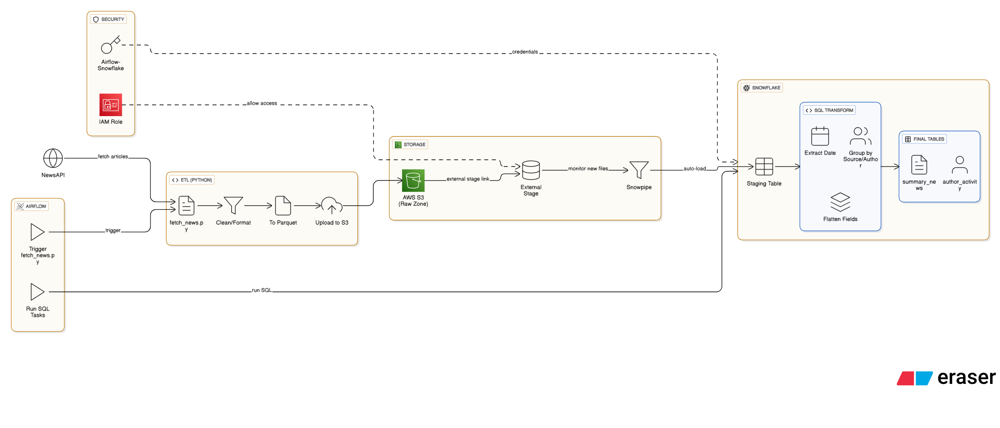
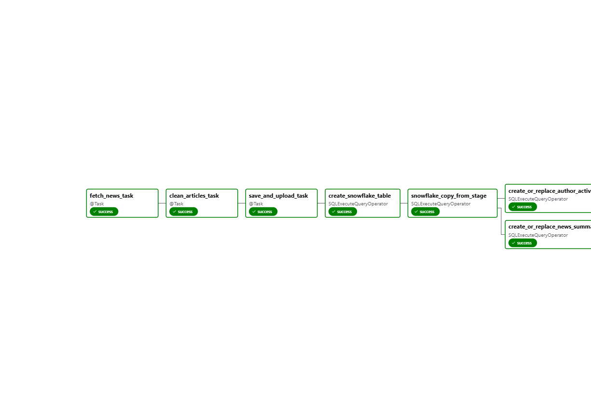

# Event-Driven News Data Ingestion and Structuring in Snowflake using Snowpipe, S3, and Airflow

This project builds an automated, event-driven data pipeline that fetches news articles from a public API, stores the data in AWS S3 as Parquet files, and ingests it into Snowflake using Snowpipe. The entire pipeline is orchestrated and scheduled using Apache Airflow. The final data is structured into meaningful summary tables inside Snowflake.

---

## 🛠️ Tech Stack

- **Python** – for API integration and data cleaning
- **AWS S3** – for raw Parquet file storage
- **Snowflake** – for data staging, storage, and transformation
- **Snowpipe** – for continuous, automated data ingestion
- **Apache Airflow** – for pipeline scheduling and orchestration
- **NewsAPI** – data source (news articles)

---

## 📊 Architecture



---

## 📂 Folder Structure

```
event-driven-snowflake-data-pipeline/
│
├── dags/
│ └── news_pipeline_airflow_dag.py
│
├── scripts/
│ └── fetch_news_etl_job.py 
│ └── snowflake_commands.sql 
│ └── requirements.txt
│
├── docs/
│ └── architecture_diagram.png
│ └── how_to_run.md
│ └── project_demo_video_link
│ └── airflow_dag_image.png
│ └── summary_news_table_output.png
│ └── author_activity_table_output.png
├── README.md 
```

---

## ⚙️ Pipeline Overview

1. Airflow triggers the DAG daily
2. `fetch_news_etl_job.py`:
   - Pulls news from the NewsAPI
   - Cleans and formats the data
   - Saves as a `.parquet` file
   - Uploads to AWS S3
3. Snowpipe listens to S3 and ingests the Parquet file into Snowflake
4. Airflow triggers SnowflakeOperator SQL tasks:
   - Creates staging and final tables
   - Populates summary tables (`summary_news`, `author_activity`)

---

## 📝 SQL Logic (in Snowflake)

- Create stage using S3
- Auto-create table using `INFER_SCHEMA`
- Load data using `COPY INTO`
- Create summary tables:
  - `summary_news`: article count per news source
  - `author_activity`: article count per author

 ---

 ## Airflow dag graph image and demo video

 

 [

 ---

## Resources

The following resources are available in the `docs/` folder of this repository:

-  **Architecture Diagram** – High-level visual of the data pipeline architecture
-  **Airflow_dag_image** – Visual representation of the DAG execution flow
-  **how_to_run.md** – Step-by-step instructions to set up and run this project locally
-  **project_demo_video_link** – Link to the project demo video

> You can open the [`docs/`](./docs) folder to view all attached guides and visual assets.

--- 

## 🔐 Confidential Information Notice

For security reasons, this repository **does not include any real credentials or sensitive information**.

The following values have been **masked, replaced, or removed** in the shared scripts:

-  **NewsAPI Key**
-  **AWS S3 Bucket Name**
-  **AWS IAM Role ARN**
-  **Snowflake Account & Connection Details**

If you're running this project yourself, please **replace these placeholders** with your actual values. Refer to the [HOW_TO_RUN.md](./docs/how_to_run.md) file for guidance.

---

 ## 👨‍💻 Author

**Varshith Chilagani**  
🔗 [Linkedin Profile](www.linkedin.com/in/varshith-chilagani)


